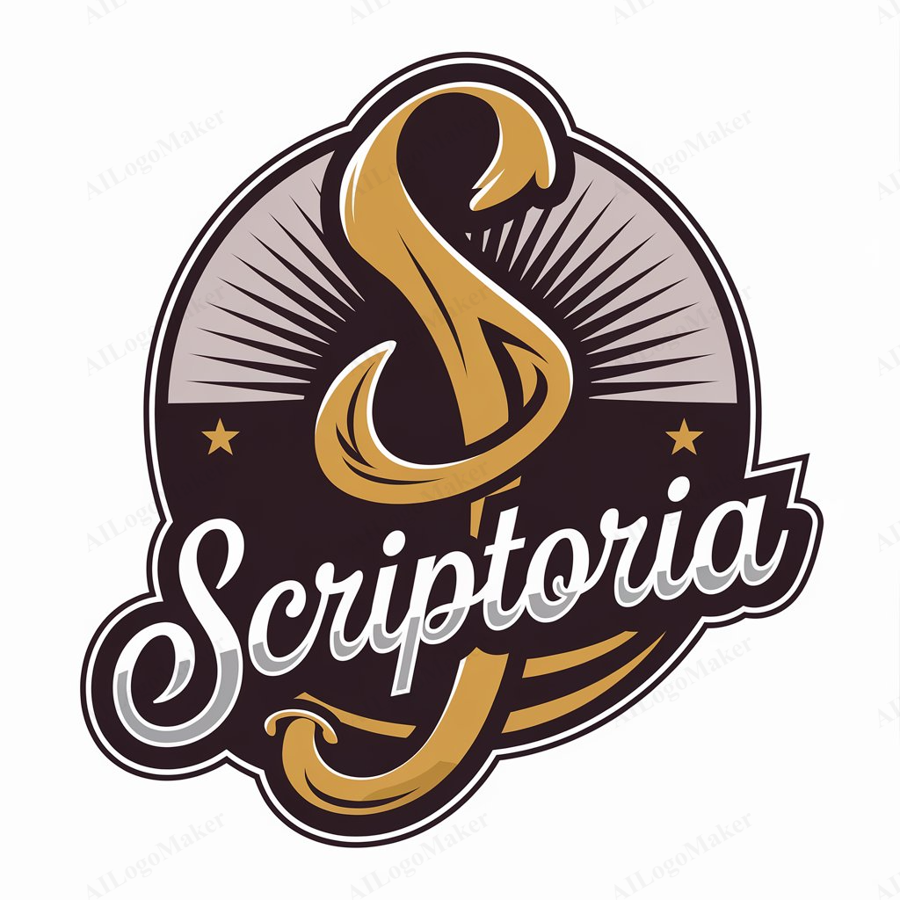

<p align="center">
  
  <h1 align="center">Scriptoria-Project</h1>
  <p align="center">A modular, AI-driven pipeline for intelligent document processing—from raw URLs to polished content.</p>
  <p align="center">
    <a href="#"></a>
    <a href="#"></a>
  </p>
</p>

---

## 📖 Table of Contents

- [✨ Features](#-features)  
- [🗂 Project Structure](#-project-structure)  
- [⚙️ Prerequisites](#️-prerequisites)  
- [🚀 Installation & Quickstart](#-installation--quickstart)  
- [📋 Terminal Commands](#-terminal-commands)  
- [🌐 Example URLs](#-example-urls)  
- [🤖 Non-GPU Users](#-non-gpu-users)  
- [🤝 Contributing](#-contributing)  
- [📄 License](#-license)  

---

## ✨ Features

- Web scraping & HTML cleaning (`src/scraper.py`)  
- Reinforcement-learning search & reward scoring (`src/rl_search.py`, `src/rl_reward.py`)  
- AI writer & reviewer agents powered by Google Gemini (`agents/ai_writer.py`, `agents/ai_reviewer.py`)  
- Interactive Streamlit UI with human-in-the-loop (`src/streamlit_app.py`)  
- FastAPI backend for integrations (`src/api_server.py`)  
- Headless CLI orchestrator (`src/main.py`)  
- Speech-to-text via Vosk, with temp-audio processing (`temp_audio/`)  
- Semantic vector storage & retrieval using Chromadb (`chromadb/`)  
- Out-of-the-box Colab support for non-GPU environments  

---

## 🗂 Project Structure

```text
.
├── agents/                  # AI writer, reviewer & voice API
├── chromadb/                # Local vector DB files
├── data/
│   ├── logo/                # Icon & branding
│   ├── model/               # Vosk small-model
│   ├── raw_content/         # Imported by Streamlit
│   ├── processed_content/   # Generated by Streamlit
│   ├── screenshots/         # UI snapshots
│   └── test-MP3-audios/     
├── nonGPU-users/            # Colab notebook + zip package
├── src/                     # Core modules & entrypoints
│   ├── api_server.py
│   ├── content_spinner.py
│   ├── human_in_loop.py
│   ├── main.py
│   ├── rl_reward.py
│   ├── rl_search.py
│   ├── scraper.py
│   ├── streamlit_app.py
│   └── versioning.py
├── temp_audio/              # Speech-to-text WAV/MP3 intermediates
├── .vscode/                 # Editor settings
├── example-urls.txt         # Sample URLs & friendly names
├── requirements.txt         # Python dependencies
└── terminal-commands.txt    # Step-by-step CLI guide
```

---

## ⚙️ Prerequisites

- Python 3.12 or higher  
- pip  
- (Optional) Git  

---

## 🚀 Installation & Quickstart

1. **Clone the repository**  
   ```bash
   git clone https://github.com/Kratugautam99/Scriptoria-Project.git
   cd Scriptoria-Project
   ```

2. **Install dependencies**  
   ```bash
   pip install -r requirements.txt
   playwright install
   ```

3. **Configure Google Gemini API key**  
   ```bash
   # PowerShell
   $env:GEMINI_API_KEY="your-api-key"

   # bash / zsh
   export GEMINI_API_KEY="your-api-key"
   ```

4. **Launch components**  
   - Streamlit UI:  
     ```bash
     streamlit run src/streamlit_app.py
     ```
   - FastAPI backend:  
     ```bash
     uvicorn src.api_server:app --reload
     ```
   - CLI orchestrator:  
     ```bash
     python src/main.py
     ```

---

## 📋 Terminal Commands

All CLI steps are captured in `terminal-commands.txt`. Here’s a quick reference:

1. Install Python deps: `pip install -r requirements.txt`  
2. Install Playwright browsers: `playwright install`  
3. Set `GEMINI_API_KEY` environment variable  
4. Run FastAPI: `uvicorn src.api_server:app --reload`  
5. Run Streamlit: `streamlit run src/streamlit_app.py`  
6. Run CLI orchestrator: `python src/main.py`  
7. For non-GPU users: open `nonGPU-users/Scriptoria_Project.ipynb` in Colab, upload the ZIP, select GPU runtime, run all cells, and click the Cloudflare link.  
8. Deployed version: see the repo’s description for the live link.  

---

## 🌐 Example URLs

`example-urls.txt` contains **5 sample entries** (each with a friendly name and URL) that demonstrate how to feed web pages into the pipeline:

```text
news_google=https://news.google.com/
wikipedia_python=https://en.wikipedia.org/wiki/Python_(programming_language)
arxiv_ai=https://arxiv.org/list/cs.AI/recent
stackoverflow_cython=https://stackoverflow.com/questions/tagged/cython
medium_nlp=https://medium.com/tag/nlp
```

- Copy or rename `example-urls.txt` to `urls.txt` (or supply your own file)  
- Streamlit & CLI modes will prompt you to select or type a “Name” and pick a URL from this list  
- You can replace, extend, or override with any other HTTP(s) links

---

## 🤖 Non-GPU Users

<details>
  <summary>Run on Google Colab (no local GPU required)</summary>

1. Open `nonGPU-users/Scriptoria_Project.ipynb` in Colab  
2. Upload `nonGPU-users/Scriptoria-Project.zip` when prompted  
3. Switch runtime to **GPU**  
4. Run all notebook cells  
5. Click the Cloudflare link to launch the hosted interface

</details>

---

## 🤝 Contributing

We welcome issues, feature requests, and pull requests!  

1. Fork the repo  
2. Create a feature branch (`git checkout -b feature/xyz`)  
3. Commit your changes (`git commit -m "Add xyz"`)  
4. Push to your branch (`git push origin feature/xyz`)  
5. Open a Pull Request  

---

## 📄 License

This project is released under the MIT License.  
See the [LICENSE](LICENSE) file for details.
