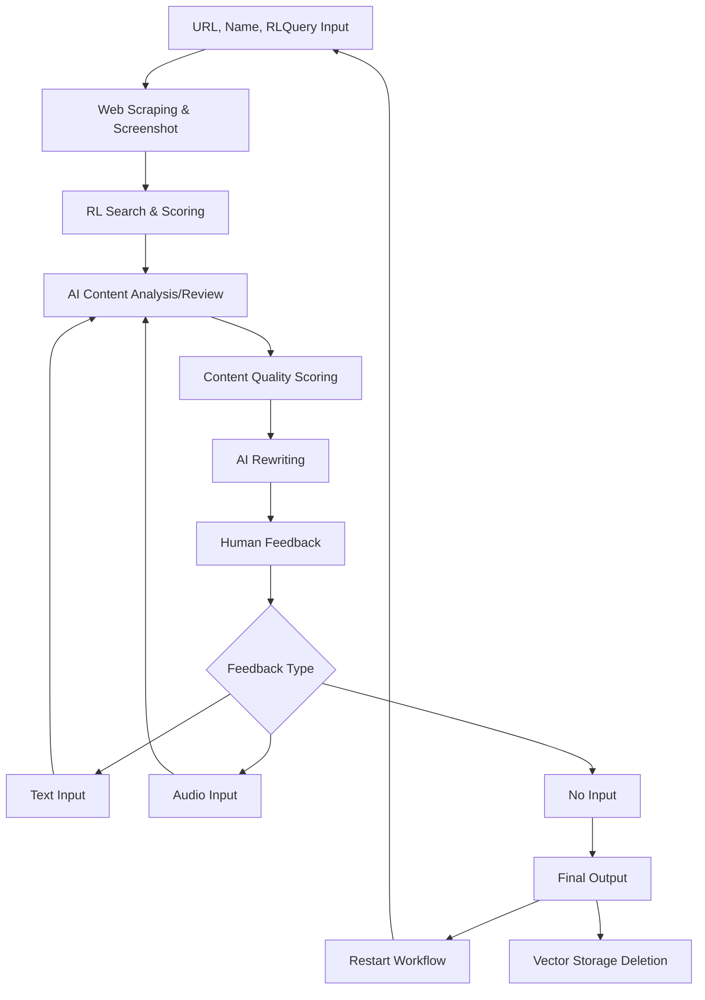

<p align="center">
  
  <h1 align="center">Scriptoria Project V2</h1>
  <p align="center">A modular, AI-driven pipeline for intelligent document processing—from raw URLs to polished content.</p>
  <p align="center">
    <a href="#"></a>
    <a href="#"></a>
    <a href="#"></a>
    <a href="#"></a>
  </p>
</p>

---

## 🎯 Overview

Scriptoria Project is an advanced AI-powered content processing system that transforms web content through intelligent scraping, reinforcement learning, and multi-agent AI collaboration. The system processes URLs through a sophisticated pipeline that includes content extraction, AI analysis, rewriting, and human-in-the-loop feedback.

### 🎥 Live Demo & UI Walkthrough

<table>
<tr>
<td width="50%">
<h4 align="center">Main Interface</h4>

</td>
<td width="50%">
<h4 align="center">Content Processing</h4>

</td>
</tr>
<tr>
<td width="50%">
<h4 align="center">Enhanced Output</h4>

</td>
<td width="50%">
<h4 align="center">Multi-modal Input</h4>

</td>
</tr>
</table>

---

## ✨ Key Features

### 🤖 AI-Powered Processing
- **Intelligent Content Analysis**: AI-driven review and scoring of web content quality
- **Multi-Agent Collaboration**: Writer and reviewer agents powered by Google Gemini
- **Reinforcement Learning**: Adaptive search and reward scoring for optimal content discovery

### 🎯 Multi-Modal Interface
- **Streamlit Web UI**: Interactive interface with real-time processing visualization
- **FastAPI Backend**: RESTful API for integration with other applications
- **CLI Orchestrator**: Command-line interface for automated workflows
- **Voice Integration**: speech-to-text via Vosk with audio processing
- **Speaking Agent**: text-to-speech on AI Written summary page

### 🔧 Advanced Architecture
- **Modular Pipeline**: Extensible components for web scraping, AI processing, and content enhancement
- **Vector Storage**: Semantic search and retrieval using ChromaDB
- **Cross-Platform**: Native support for Windows, Linux, and macOS
- **GPU Optimization**: Optional GPU acceleration with CPU fallback

---

## 🏗️ System Architecture


```mermaid
graph TD
    A[URL, Name, RLQuery Input] --> B[Web Scraping & Screenshot]
    B --> C[RL Search & Scoring]
    C --> D[AI Content Analysis/Review]
    D --> E[Content Quality Scoring]
    E --> F[AI Rewriting]
    F --> G[Human Feedback]
    G --> H{Feedback Type}
    H --> I[Text Input]
    H --> J[Audio Input]
    H --> K[No Input]
    I --> D
    J --> D
    K --> L[Final Output]
    L --> M[Restart Workflow]
    L --> N[Vector Storage Deletion]
    M --> A
```

---

## 🚀 Quick Start

### Prerequisites
- **Python 3.11** or higher
- **Google Gemini API Key** ([Get free API key](https://aistudio.google.com/app/api-keys))

### Installation Options

#### 🐍 Option 1: Conda Environment (Recommended)
```bash
# Create environment from YAML
conda env create -f environment.yml
conda activate scriptenv

# Install Playwright browsers
playwright install
```

#### 🛠️ Option 2: Virtual Environment and Install Dependencies

```bash
# Create virtual environment
python -m venv scriptenv

# Activate (Windows PowerShell)
.\scriptenv\Scripts\Activate.ps1

# If permission Error:
Set-ExecutionPolicy -ExecutionPolicy Bypass -Scope Process -Force

# Install Python packages
pip install -r requirements.txt

# Install Playwright browsers
playwright install
```

#### 🔑 Set API Key
```bash
# PowerShell
$env:GEMINI_API_KEY="your-api-key-here"

# bash/zsh
export GEMINI_API_KEY="your-api-key-here"
```

---

## 🎮 Usage Modes

### 🌐 Streamlit UI (Recommended for Beginners)
```bash
streamlit run src/streamlit_app.py
```
**Features:**
- Interactive web interface
- Real-time processing visualization
- Audio input and output support
- Step-by-step workflow guidance

### 🔌 FastAPI Backend
```bash
uvicorn src.api_server:app --reload
```
**API Endpoints:**
- `GET /` - API documentation
- `GET /write?url=link` - Content writing endpoint
- `GET /review?url=link` - Content review endpoint

### 💻 CLI Orchestrator
```bash
python src/main.py
```
**Features:**
- Lightweight command-line interface
- Automated batch processing
- Integration with existing workflows

---

## 📁 Project Structure

```
Scriptoria-Project/
├── agents/                   # AI Agent Modules
│   ├── ai_writer.py          # Content generation agent
│   ├── ai_reviewer.py        # Quality assessment agent
│   └── voice_api.py          # Speech processing
├── chromadb/                 # Vector Database Storage
├── data/
│   ├── demo/                 # Demonstration screenshots
│   ├── logo/                 # Brand assets
│   ├── model/                # Vosk speech model
│   ├── raw_content/          # Original content storage
│   ├── processed_content/    # Enhanced content storage
│   └── screenshots/          # UI documentation
├── src/                      # Core Application
│   ├── api_server.py         # FastAPI backend
│   ├── main.py               # CLI entry point
│   ├── rl_reward.py          # RL search result reward function
│   ├── rl_search.py          # Intelligent search
│   ├── scraper.py            # Web content extraction
│   ├── streamlit_app.py      # Primary GUI Application
│   └── versioning.py         # Content version management
├── .vscode/                  # Editor settings
├── example-urls.txt          # Sample URLs & friendly names
├── requirements.txt          # Python dependencies
├── terminal-commands.txt     # Step-by-step guide to run it in CLI, Streamlit and API mode
├── enviroment.yml            # Enviroment Config Setup by "conda".
├── output.mp3                # Output MP3 generated from streamlit_app.py and acts as a record of last webpage audio
└── README.md                 # Instructions file
```

---

## 🎯 Workflow Demonstration

### Step 1: Input & Configuration


**Features:**
- URL input with validation
- Content naming and categorization
- Reinforcement learning query configuration
- Example URL integration

### Step 2: Content Acquisition 


**Process:**
- Intelligent web scraping with HTML cleaning
- Screenshot capture for visual reference
- Content structure analysis

### Step 3: AI Analysis & Scoring


**Analysis Includes:**
- Content quality assessment
- Readability scoring
- Improvement recommendations
- Text-to-speech audio generation

### Step 4: Content Enhancement


**Enhancement Features:**
- AI-powered content rewriting
- Quality improvement tracking
- Style and tone optimization
- Multi-format output support

### Step 5: Human-in-the-Loop
<table>
<tr>
<td width="50%">
<h4>Text Feedback</h4>

</td>
<td width="50%">
<h4>Audio Feedback</h4>

</td>
</tr>
</table>

**Feedback Options:**
- Text-based suggestions and edits
- Voice feedback with speech-to-text
- Iterative improvement cycles
- Quality validation

### Step 6: Final Output & Options


**Output Features:**
- Version management
- Process restart capability
- Export functionality

---

## 🌐 Example Content Sources

The system works with various web content types. Example URLs include:

| Content Title           | Example URL                                                                 | Content Type         | Use Case                          |
|-------------------------|------------------------------------------------------------------------------|----------------------|-----------------------------------|
| **Joy of Discipline**   | [library.acropolis.org](https://library.acropolis.org/the-joy-of-discipline/) | Philosophical Essay  | Personal development insights     |
| **Gates of Morning**    | [Wikisource](https://en.wikisource.org/wiki/The_Gates_of_Morning/Book_1/Chapter_1) | Literature            | Classic text modernization        |
| **Born or Built Smart** | [Psychology Today](https://www.psychologytoday.com/us/blog/curiosity-code/202508/born-smart-or-built-smart-the-truth-about-intelligence-and-effort) | Article               | Intelligence and effort analysis  |
| **Sufficient Reason**   | [Stanford Encyclopedia](https://plato.stanford.edu/entries/sufficient-reason/) | Academic              | Conceptual deep dive              |
| **Infinity's Existence**| [Scientific American](https://www.scientificamerican.com/article/what-if-infinity-didnt-exist/) | Research              | Abstract theory accessibility     |

**Sample URLs File:** `example-urls.txt` contains curated starting points.


---

## 🖥️ CLI Mode Examples

<table>
<tr>
<td width="50%">
<h4>CLI Interface Top Output</h4>

</td>
<td width="50%">
<h4>CLI Interface Bottom Output</h4>

</td>
</tr>
</table>

**CLI Advantages:**
- Scriptable and automatable
- Resource-efficient operation
- Batch processing capabilities
- Integration with CI/CD pipelines

---

## 🔧 Advanced Configuration

### Environment Variables
```bash
# Required
GEMINI_API_KEY="your-gemini-api-key"
```

### Custom Content Processing
1) `src/rl_reward.py` for custom scoring algorithms 
2) `agents/ai_writer.py` for writing style customization
3) `agents/ai_reviewer.py` for reviewing style customization
4) `src/versioning.py` for different aspects of versioning.

---

## 🚀 Performance Optimization

### GPU Acceleration
The system automatically detects and utilizes GPU resources when available. Key optimizations include:

- **TensorFlow GPU support** for ML operations
- **ONNX Runtime** for model inference acceleration
- **Parallel processing** for multi-document handling

### Memory Management
- **Chunked processing** for large documents
- **Efficient vector storage** with ChromaDB
- **Automatic cache management**

---

## 🤝 Contributing

We welcome contributions! Please see our development guidelines:

1. **Fork** the repository
2. **Create** a feature branch (`git checkout -b feature/amazing-feature`)
3. **Commit** your changes (`git commit -m 'Add amazing feature'`)
4. **Push** to the branch (`git push origin feature/amazing-feature`)
5. **Open** a Pull Request

---

## 🆘 Support & Troubleshooting

### Common Issues

**API Key Problems:**
```bash
# Verify API key is set
echo $GEMINI_API_KEY  # Linux/Mac
echo $env:GEMINI_API_KEY  # Windows PowerShell
```

**Playwright Installation:**
```bash
# Reinstall browsers if needed
playwright install
```

**Dependency Conflicts:**
```bash
# Fresh environment setup
conda env remove -n scriptenv
conda env create -f environment.yml
```
---

## 🎊 Acknowledgments

- **Google Gemini** for AI capabilities
- **Vosk** for speech-to-text functionality
- **Chromadb** for vector storage solutions
- **Streamlit** for interactive UI components
- **Playwright** for robust web scraping

---

<div align="center">

### 🛠️ Made with Precision & 🧠  
## ✨ **Kratu Gautam** ✨

</div>

---

🎯 *Architect of agentic RL workflows, reproducible environments, and browser-audible AI interfaces.*  
💡 *Driven by clarity, modularity, and a passion for empowering teams through automation and documentation.*

🔗 **GitHub:** [Kratugautam99](https://github.com/Kratugautam99)  
📘 **Project:** [Scriptoria – AI-Driven Content Processing](https://github.com/Kratugautam99/Scriptoria-Project)

---

## 📄 License

This project is licensed under the MIT License - see the [LICENSE](LICENSE) file for details.

---


